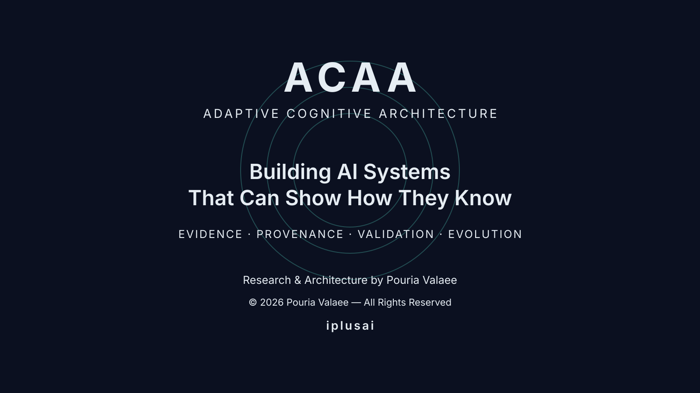

# ACAA — Adaptive Cognitive Architecture v0.4

ACAA v0.4 is a validated simulation and experimental research artifact for the Adaptive Cognitive Architecture project.

## Validation status

- **Version:** v0.4
- **Validation:** Achieved
- **Gatekeeper Decision:** PASS
- **Step 8:** Complete
- **Execution Run:** `31516580718`
- **Validation Run:** `31516959482`
- **Validation Job:** `93864388292`
- **Validated execution commit:** `50892a3be4bf05b54283514ccc6fd4798703aa35`
- **Evidence:** Independent execution artifacts, SHA-256 manifest, independent validator result, and formal Gatekeeper record.

The formal decision record is maintained at `docs/validation/ACAA_v0.4_GATEKEEPER_DECISION_2026-08-11.md`.

## Repository structure

- `value_flow_simulator_v0.4.py` — simulation engine
- `independent_validator_v0.4.py` — independent validation logic
- `.github/workflows/` — automated execution, validation, and regression workflows
- `docs/validation/` — validation and governance records
- `docs/ACAA_VISUAL_IDENTITY.md` — canonical visual identity and attribution standard
- `assets/acaa-visual-identity.svg` — canonical ACAA identity artwork

## Visual identity and attribution

**ACAA — Adaptive Cognitive Architecture**

**Research & Architecture by Pouria Valaee**  
**© 2026 Pouria Valaee — All Rights Reserved**  
**iplusai**

The author attribution is part of the canonical visual identity and should remain attached to official ACAA artwork, architecture diagrams, research figures, release graphics, and presentation covers whenever space permits.

## Provenance and attribution

**Creator / Author / Gatekeeper**

- **Full name:** Pouria Valaee
- **Email:** pouria@pouriavalaee.ir
- **LinkedIn:** https://www.linkedin.com/in/pouria-valaee-6746a6208/
- **Personal website:** https://pouriavalaee.ir

Authorship and project provenance are documented through source metadata, version-controlled history, validation artifacts, and canonical project records. These records document provenance and attribution; they do not constitute formal legal registration of intellectual property rights.

## Scope

ACAA v0.4 has passed the validation requirements defined for this version. The validation result does not by itself establish generalizability, production readiness, or scientific validity beyond the defined validation scope.

## Reproducibility

The repository preserves the validated source revision and the evidence references needed to inspect the v0.4 validation chain. Claims of reproducibility should be limited to procedures explicitly defined and demonstrated by the project.

## Development

Changes after the validated v0.4 baseline should be developed as controlled revisions and subjected to a new validation cycle when they affect validated behavior, assumptions, or evidence contracts.
